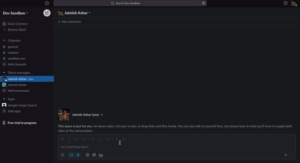
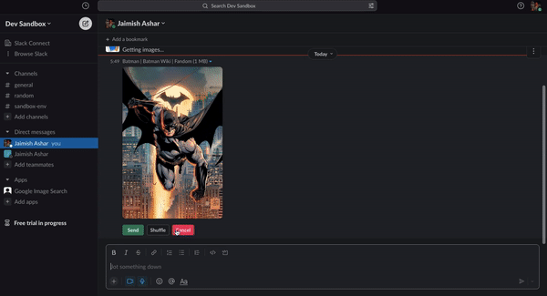
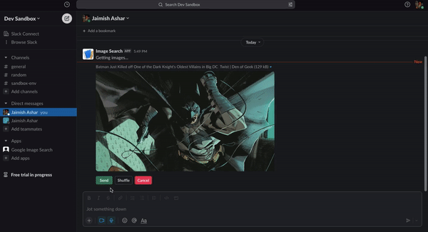

# Slack App backend built with Express

An Express-based API that looks up images based on an input string received from a slash command from a Slack client application.

## Demo 

- Lookup an image using the /image-search slash command


- Shuffle existing image


- Send the selected image


## Prerequisties

### Install packages and start the Express Server

```bash
npm i
npm start
```

### Run ngrok proxy on your local machine

https://ngrok.com/

```bash
ngrok http 3000
```
**This is required because slash commands and interactive components (e.g buttons) from Slack are handled through a SSL-secured URL.


### Create a Slack App

https://api.slack.com/apps

- Create a Slack App
  - Use these information in "App Credentials" (https://api.slack.com/apps/{apiAppId}/general)
    - Client ID, Client Secret
    - Signing Secret
- Activate incoming Webhooks (https://api.slack.com/apps/{apiAppId}/incoming-webhooks)
- Add a Slash Command
  - `/image-search` command
  - Request URL: `https://{ngrok domain}/slack/command`
- Enable Interactive Components
  - Request URL: `https://{ngrok domain}/slack/interaction`
- Add Necessary Permissions
  - `channels:history`
  - `commands`
  - `im:history`
  - `incoming-webhook`
  - `links:read`

### Configure env variables (required only if you're using Bolt)

```bash
vi .env
```

```json
SLACK_BOT_TOKEN=xoxb-xxxxxxxxx
SLACK_SIGNING_SECRET=xxx https://api.slack.com/docs/verifying-requests-from-slack
SLACK_APP_PORT=3000
```

## Extendability

The ```ImageSearch``` abstract class inside ```helpers/ImageSearch``` can easily be extended to support other providers like Yahoo or Bing for image search. Currently, the app supports Google image searches through the Serp API. See ```GoogleImageSerpApi``` inside ```helpers/ImageSearch``` for more details.

## Todos/Roadmap

1. Send back the selected image from the current Slack user to the intended recipient. (currently, the image is private)
2. Explore the Serp npm package https://github.com/serpapi/google-search-results-nodejs as it may be easier to use. 
3. Improve the image shuffling logic. Currently, it can only choose a random image within the first 100 results. 
4. If any image URL is inaccessible or cannot be downloaded for whatever reason, the resulting image block will be invalid. Add a utility that can check for this. 
5. Write some test cases for the third party API.
6. The project could benefit from the integration of Typescript. 


